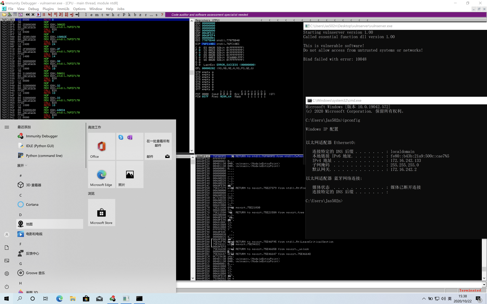

## Exploit steps

**1. Spiking**

**2. Fuzzing**

**3. Finding The ffset**

**4. Overwriting The EIP**

**5. Finding Bad characters**

**6. Finding the Right Module**

**7. Generating ShellCode**

**8. Got Shell**

# Vulnserver

Check my blog at http://thegreycorner.com/ for more information and updates to this software.

## About the software

Vulnserver is a multithreaded Windows based TCP server that listens for client connections on port 9999 (by default) and allows the user to run a number of different commands that are vulnerable to various types of exploitable buffer overflows.

This software is intended mainly as a tool for learning how to find and exploit buffer overflow bugs, and each of the bugs it contains is subtly different from the others, requiring a slightly different approach to be taken when writing the exploit.

Though it does make an attempt to mimic a (simple) legitimate server program this software has no functional use beyond that of acting as an exploit target, and this software should not generally be run by anyone who is not using it as a learning tool.

## Compiling the software

Binaries have been provided in this package, however if you wish to compile the software from the provided source files instructions are included in the file COMPILING.txt.

## Running the software

To run the software, simply execute vulnserver.exe.  The provided essfunc.dll library must be in a location where it can be found by vulnserver.exe - keeping both files in the same directory will usually work fine.

To start the server listening on the default port of 9999, simply run the executable, to use an alternate port, provide the port number as a command line parameter.

Once the software is running, simply connect to it on port 9999 using a command line client like netcat.  Issue a HELP command (case sensitive) to see what functions are supported and go from there....

## Exploiting Vulnserver

Detailed instructions on how to exploit this software, or example exploit files have not been included with this package - this is to provide a challenge for those who want it and also a disincentive to cheat by peeking at the answer.  

If you're stuck, you can refer to the following to get an idea of how to proceed. Some of the following links provide full tutorials that teach the skills necessary to exploit and discover the vulnerabilities in Vulnserver, along with complete walkthroughs for some of the simpler vulnerabilities. In the case of the more difficult issues, some of the links might provide just a hint of how you can proceed...

* [An Introduction to Fuzzing: Using SPIKE to find vulnerabilities in Vulnserver](http://thegreycorner.com/2010/12/introduction-to-fuzzing-using-spike-to.html)
* [Exploit Writers Debugging Tutorial](http://thegreycorner.com/2011/03/exploit-writers-debugging-tutorial.html)
* [Simple Stack Based Buffer Overflow Tutorial for Vulnserver](http://thegreycorner.com/2011/03/simple-stack-based-buffer-overflow.html)
* [SEH Based Buffer Overflow Tutorial for Vulnserver](http://thegreycorner.com/2011/06/seh-based-buffer-overflow-tutorial-for.html)
* [Egghunter based exploit for Vulnserver](http://thegreycorner.com/2011/10/egghunter-based-exploit-for-vulnserver.html)
* [Restricted Character Set Buffer Overflow Tutorial for Vulnserver](http://thegreycorner.com/2011/12/restricted-character-set-buffer.html)
* [Omlette Egghunter Shellcode](http://thegreycorner.com/2013/10/omlette-egghunter-shellcode.html)

## License

See LICENSE.txt.

## Warning

UNDER NO CIRCUMSTANCES SHOULD THIS SOFTWARE BE RUN ON ANY SYSTEM THAT IS CONNECTED TO AN UNTRUSTED NETWORK OR THAT PERFORMS CRITICAL FUNCTIONS.  THE AUTHOR IS NOT RESPONSIBLE FOR ANY DAMAGES THAT MAY OCCUR FROM USING THIS SOFTWARE IN THIS OR ANY OTHER MANNER.  USE AT YOUR OWN RISK.
